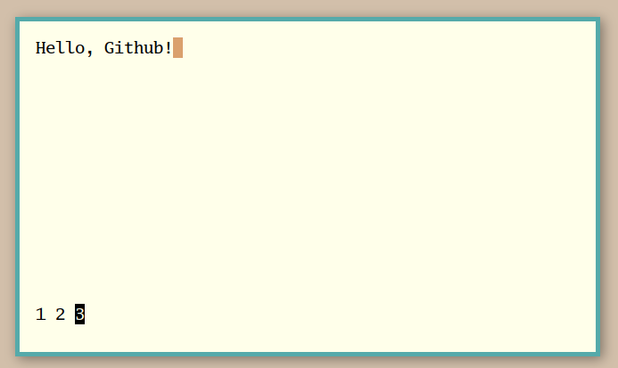

# 🗡 arzhur

`arzhur` is a simple program that implements one-line editing windows as a filter for text from stdin or command line arguments. It was originally intended as a companion program for `merlin` as a graphical supplement to line editing, although it could theoretically be applied usefully elsewhere.

**Functionality:**

`arzhur` accepts text from either stdin or supplied arguments and will treat each argument or each line of input as a separate "window". Each window can be accessed and be edited independently via the tab pane at the bottom of the screen. At any time an individual window or the entire group can be returned to stdout and the program exited.

**Keybinds:**

* Editing Mode
	- `ESCAPE`: Enter command mode
	- `ENTER`: Exit and print the contents of the current window to stdout
* Command Mode
	- `ESCAPE`: Enter editing mode
	- `h`: Go backwards a tab
	- `l`: Go forwards a tab
	- `a`: Exit and print the contents of all of the windows joined by newlines to stdout
	- `q`: Exit and return nothing

**Merlin:**

`arzhur` comes with a small package (`arzhur.mn`) for basic `merlin` interaction.

* Commands
	- `arzhur`: Open the first atom on the stack for editing
	- `arzhur-stack`: Open the entire stack for editing
	- `arzhur-edit`: Edit an atom and replace the current line with the result
	- `arzhur-peer`: Edit a selected part of the current volume
	- `arzhur-line`: Edit the current line
	- `arzhur-cursor`: Edit all of the current line's text up until the cursor

**Screenshot:**

