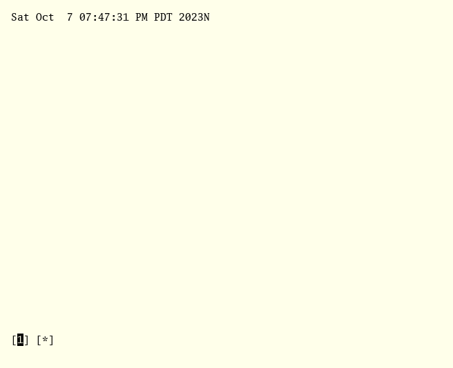

# 🗡 arzhur

`arzhur` is a simple program that implements a interactive filter for the editing, execution, and piping of arbitrary text.

## Selection filter

`arzhur` can receive text from either stdin or supplied arguments and will treat each argument or each line of input as a separate "window". Each window may be edited and printed to stdout by itself or joined with the other lines.

## Window management

Windows can be selected with the `h` and `l` keys, created with `n`, and deleted (only the final window) with `d`.

## Acme-style command execution

`arzhur` implements a system for executing and piping text similar to that of `acme`. The `!` command functions as an equivalent to the middle click, executing the focused text as a command a creating a new window for its output. `<` replaces the executed text, or the contents of the marked window with output. `>` pipes the marked text, putting the output in a new window. `|` pipes and replaces at once.

## Keybinds

* Editing Mode
	- `ESCAPE`: Enter command mode
	- `ENTER`: Exit and print the contents of the current window to stdout
* Command Mode
	- `ESCAPE`: Enter editing mode
	- `ENTER`: Exit and print the contents of the current window to stdout
	- `h`: Go backwards a tab
	- `l`: Go forwards a tab
	- `a`: Exit and print the contents of all of the windows joined by newlines to stdout
	- `q`: Exit and return nothing
	- `n`: Create a new, empty window
	- `d`: Delete the last window
	- `m`: Mark or unmark the current window
	- `M`: Unmark the marked window
	- `p`: Insert the marked text into the current window
	- `N`: Insert a newline character
	- `c`: Clear the contents of the current window
	- `!`: Execute the contents of the current window as a command, with output going to a new window
	- `<`: Replace the current or marked window's text with the output of itself as a command
	- `>`: Pipe the marked text to the current window's command put the output in a new window
	- `|`: `<` and `>` combined.

## Options

```
Usage of arzhur:
  -n	Open an empty window on start.
  -s	Don't split input into lines.
```

## Screenshot

